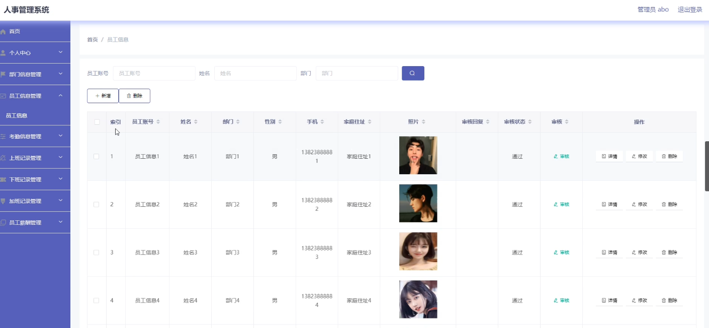
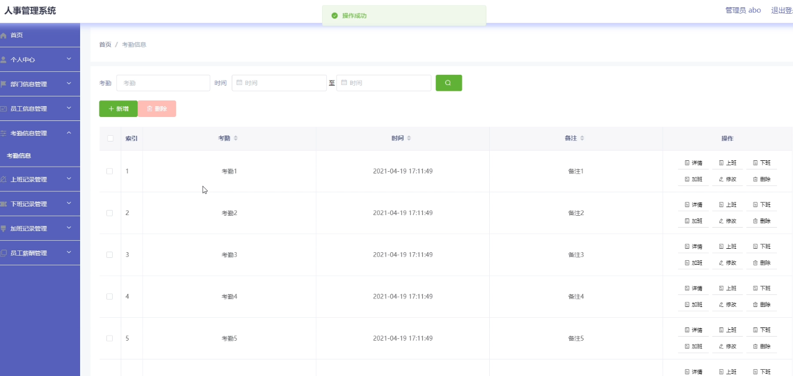
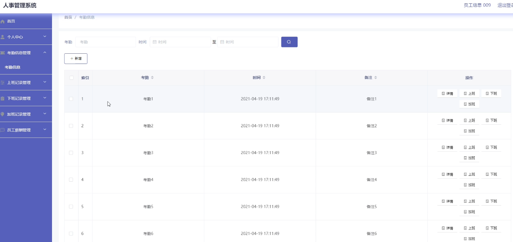
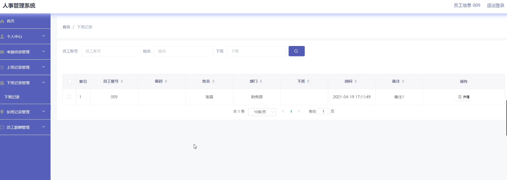

**项目简介：**  
本项目基于主流的前后端分离架构，采用 **SpringBoot + Vue 技术栈**，配套 **MySQL 数据库**，适用于毕业设计与课题实训开发。  
本人已整理了超 **4000 多套毕业设计源码+论文+开题报告+PPT...**，涵盖 **Java、SpringBoot、Vue、SSM、uni-app 小程序、PHP、Android** 等方向，支持功能修改定制与论文服务。  
**团队提供以下服务：**  
- 项目代码修改与调试  
- 数据库配置与远程协助  
- 论文定制与修改  
**获取更多的4000多套源码或SQL文件请联系：**  
- QQ：3906443360 微信：BesheHelp

# springboot066人事系统

（1）加班记录信息的实体属性图如图4.5所示：

图4.5加班记录信息实体属性图

（2）考勤信息实体属性图如图4.6所示：

图4.6考勤信息实体属性图

（3）部门信息实体属性图如图4.7所示：

图4.7部门信息实体属性图

4.3.2数据库设计表

基于vue的人事系统需要后台数据库，下面介绍数据库中的各个表的详细信息：

表4.1 部门信息

表4.2 加班记录

表4.3 考勤信息

表4.4 上班记录

表4.5 用户表

表4.6 下班记录

表4.7 员工薪酬

表4.8 员工信息

5系统详细实现

5.1 管理员模块的实现

5.1.1 员工信息管理

基于vue的人事系统的系统管理员可以管理员工信息，可以对员工信息添加修改删除操作。具体界面的展示如图5.1所示。

图5.1 员工信息管理界面

5.1.2 考勤信息管理

系统管理员可以考勤信息进行添加，修改，删除操作。具体界面如图5.2所示。

图5.2 考勤信息管理界面

5.2 员工模块的实现

5.2.1 考勤信息管理

员工可以对考勤信息进行添加，修改删除操作。界面如下图所示：

图5.3 考勤信息管理界面

5.2.2 下班记录管理

员工登录后，可以对查看自己的下班记录。界面如下图所示：

图5.4 下班记录界面